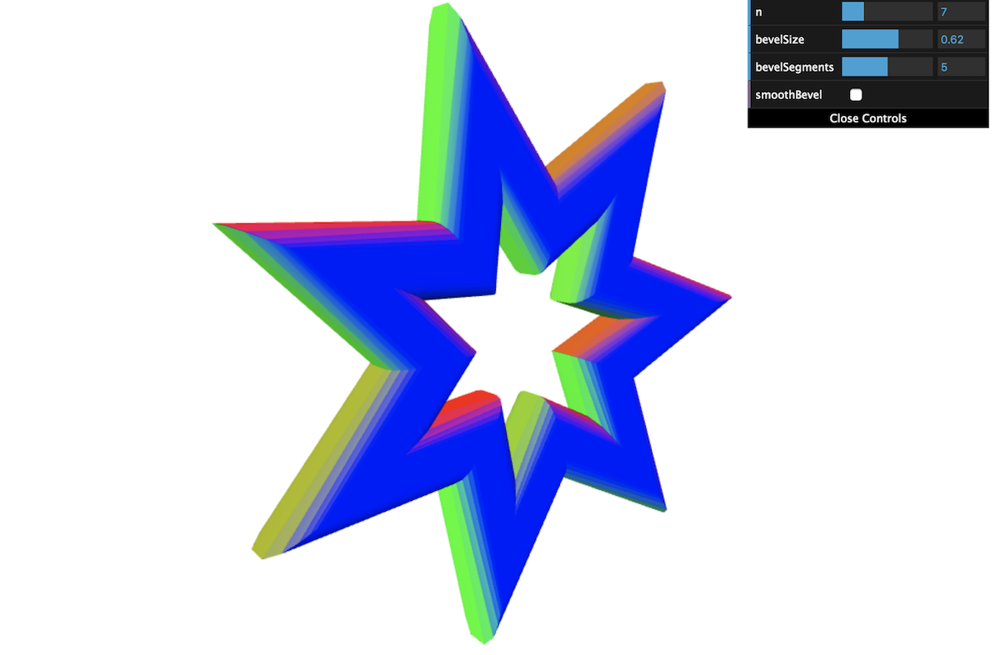

A simple example of using [geometry-extrude](https://github.com/pissang/geometry-extrude) for extruding polygon to mesh and using [regl](https://github.com/regl-project/regl) for rendering.

[Live demo](https://pissang.github.io/geometry-extrude-example-regl/)

